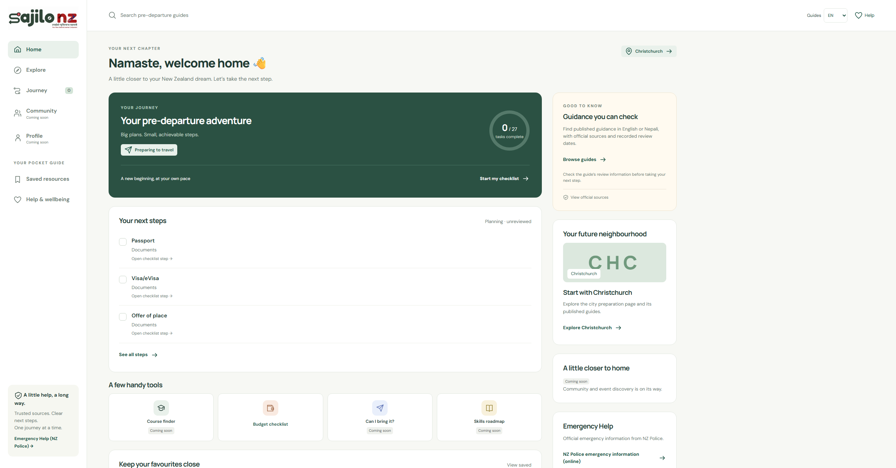

# Approved branding and prototype-fidelity correction

6 October 2026 (New Zealand). Branch: `codex/approved-branding-navigation`, existing PR #16. Base: merged PR #15 (`b773f892ff4a993e33605ab4ff5d47593ceb07df`). This record supersedes the initial full-width-logo-header layout in this PR. No deployment or merge.

## Reference and scope

Read the preserved `prototype/index.html`, `prototype/app.js` (shell, Home and icon paths) and `prototype/style.css`. The user's second screenshot is the visual target. Reused the source's 242px sidebar, 87px toolbar, 1700px left-aligned main maximum width, 60px large-screen padding, 345px supporting column and 30px gutter. Reused DM Sans/Manrope, line-icon paths, borders, corners, task spacing and responsive breakpoints. The hero keeps the muted green in the supplied target screenshot (the preserved source uses a stronger green).

The user's latest section-order instruction supersedes the earlier six discovery cards below the hero. Home now orders welcome/location → genuine journey progress → next steps → tools → saved preview, alongside supporting cards. Explore remains available with its existing catalogue. No prototype source, backend, guide publication, storage schema or saved-progress policy changes.

## Approved logo and typography

The complete local `frontend/src/assets/sajilonz-logo.png` is unchanged: 2172 × 724, 966,632 bytes, SHA-256 `3F38D073A2E5C546E2063076A2BF7FE0EBDCFD8B3BF1F20F1FEB8061567DE1D1`. Source and repository hashes rechecked equal. Reusable SajiloLogo preserves intrinsic dimensions, 3:1 aspect ratio and approved English/Nepali alternative text. No cropping, redrawing, recolouring, compression, relettering or adjacent repeated taglines. Desktop logo fits inside the white sidebar; mobile uses the same complete image at 156px.

DM Sans and Manrope are bundled locally from Google Fonts' open-source font repository, with their SIL Open Font Licences alongside them. The existing build precaches emitted assets for offline use. No runtime font-network dependency, new npm dependency or paid service.

## Working navigation and content

- Primary sidebar: Home, Explore, Journey (discloses both existing checklist routes), Community and Profile (noninteractive Coming soon).
- Pocket guide: Saved resources links to the existing saved page; Help & wellbeing discloses guides, official sources and the existing official NZ Police emergency link.
- Toolbar search opens the existing guide search. The compact guide-language selector preserves language/stage/city/topic context on guide screens; elsewhere it opens guides in the chosen language. Help links to NZ Police. No fake global search, keyboard-shortcut hint, notification bell, account control or prototype badge.
- Mobile uses a labelled, keyboard-operable inline Menu button with expanded state and automatic closure on route changes. It replaces the prototype's bottom navigation to retain all existing destinations without pretend Community/Profile routes.
- Home completion calls the existing checklist use case and repository. After a completed item leaves the next-steps list, keyboard focus moves to the next checkbox (or heading when all complete). Budget links to the real first-month-budget task; calculator/other tools are not implied to exist.
- No invented immigration update, event, date or editorial review. Planning tasks remain labelled unreviewed; guide sources/review dates remain in the existing guide screens. Home shows no cached guide body or fake verified count.
- Ordinary online readiness/implementation messages are hidden on Home. Actual offline and registration-failure messages remain visible. Other guide/offline flows remain unchanged.

## Acceptance and actual verification

- `npm run check`: passed.
- `npm test`: passed, 6 prototype + 64 frontend/domain tests.
- `npm run test:e2e`: passed, 51 desktop/mobile Chromium tests; one duplicate mobile invocation of the desktop reference-capture test intentionally skipped. Includes production build and isolated synthetic Django API.
- Desktop source and implementation rendered at the same **2492 × 1305 CSS-pixel viewport, DPR 1**, matching the attachment's original dimensions. Reference capture serves the unchanged prototype files through a test-only route, with its original font families supplied locally for deterministic rendering. The reference's sample claims are only visible in the reference screenshot, never promoted to app content.
- Automated geometry checks compare sidebar, toolbar, grid and hero x/width; toolbar/grid/hero y coordinates match within 4px. Both captures visually inspected together; fixed initial focus scrolling the toolbar out of view, oversized next-step rows and support-card background specificity.
- Screenshots and overflow/aspect-ratio checks at 320, 390, 768, 1440 and 2492px. Mobile Menu inspected open and closed; keyboard navigation, route/task focus, Home completion and refresh persistence, independent first-week progress, English/Nepali guide selection, saved copies/withdrawals and offline logo covered.
- Logo hash equality verified. No real-device Safari, screen-reader session, human usability session, PostgreSQL/migration/container/recovery/deployment checks performed locally in this frontend-only correction. CI remains the merge gate; synthetic tests are not content review.

## Screenshots and remaining differences

| Updated app | Preserved prototype (sample content, reference only) |
| --- | --- |
|  |  |

[Mobile Home](screenshots/home-fidelity/mobile.png) · [Mobile menu](screenshots/home-fidelity/mobile-menu.png)

Intentional differences: approved complete logo; real 27-task pre-departure journey instead of sample four-task work journey; working budget checklist; unavailable-feature labels; no sample news/events, fake bookmark actions, profile or notification controls. Supporting-card heights vary with genuine content. Search is scoped to existing guides. The UI remains English; the existing English/Nepali switch is for guide content, not a claim of full interface localisation. Reviewed UI translations remain separate work.

The logo's embedded taglines and fine artwork are small at sidebar/mobile size. Nothing is cut out or distorted. A separate user-approved compact asset is required to improve small-size readability. Real-device/accessibility and content/translation review follow-ups from prior sprints remain open.
